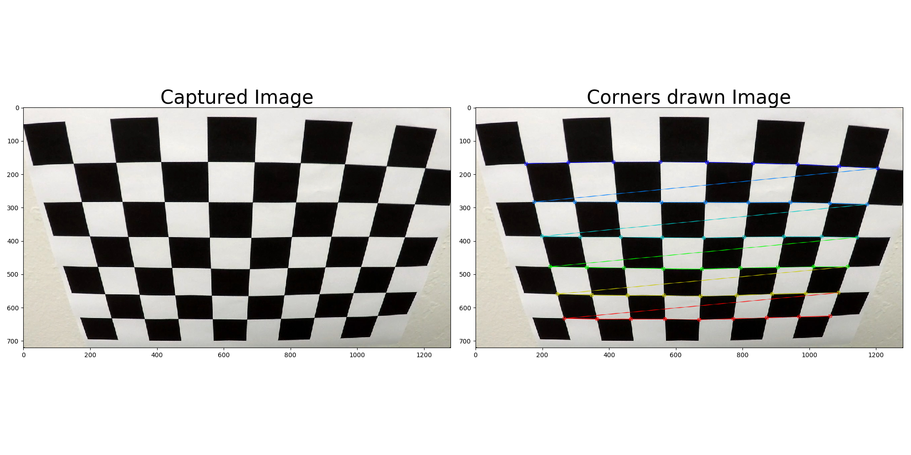
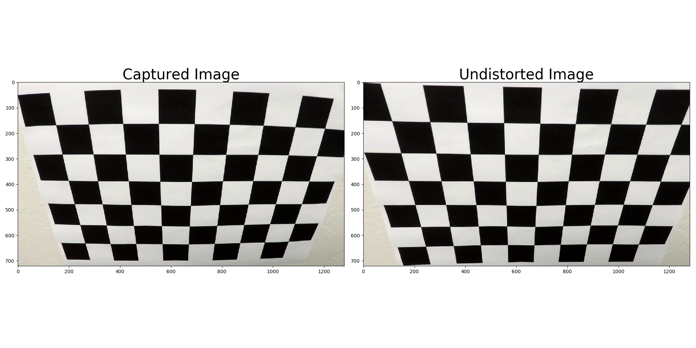
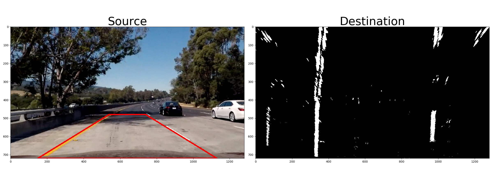
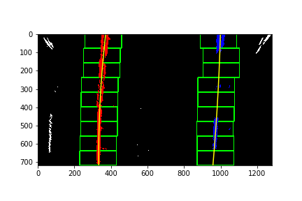
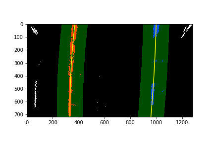
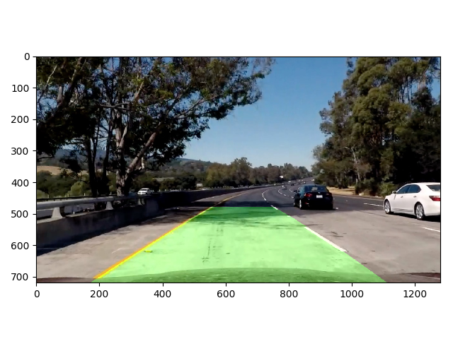
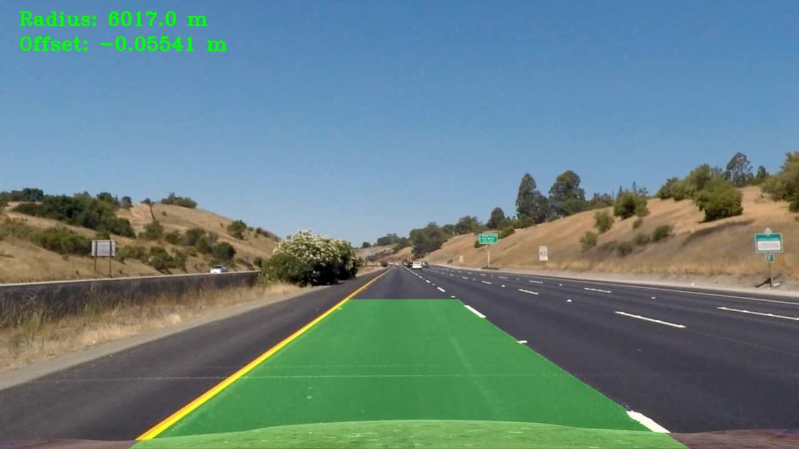
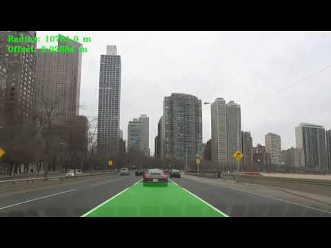

This repository contains the code and images necessary to calibrate a camera, perform perspective transforms on images, and ultimate detect and track lane line features from dash cam footage.

---
### Camera Calibration & Distortion Correction

When working with a camera, there is always a certain amount of lens distortion that occurs. Lens distortion is where distances or sizes of objects in the center of the photo and the sides are not accurately preserved. The amount of distortion that occurs depends on the camera. Luckily, a distorted photo and a distortion-corrected photo are just a linear matrix transform of each other. This means that we can generate that matrix transform according to each unique camera's lens distortion.  

To do so, we need to calibrate the camera using a chessboard. OpenCV includes functions to extract the camera matrix transform from a chessboard image because chessboards are perfectly uniform. The process looks like this:

<figure>

<figcaption>The coordinates of the corners are stored in a list.</figcaption>
</figure>

The coordinates are passed to `cv2.undistort()` which returns the matrix transform and distortion. These are then used to correct photos for distortion.

<figure>

<figcaption>Applying the the linear matrix transform to correct distortion.</figcaption>
</figure>

---
###  Gradient and Color Thresholding

When we are using very traditional computer vision and machine learning techniques, it's often the case that binary (black and white / zero and one) matrices/images are the best to work with. This is not the same as *grayscale* where there is a single color channel with pixel values that exist in the range `[0, 255]`. Rather, we must apply some *filters* to a grayscale image to push those values ***to either 0 or 1*** (i.e. 255).

---
### Perspective Transforming

Now that we have the lanes in a nice, easy-to-work-with binary form, we need to remove all of the other extraneous information and only look at the lines. We can use `cv2.getPerspectiveTransform` and `cv2.warpPerspective` to generate a linear matrix transform between a source polygon and a destination polygon and then apply that transform to an image. It looks like this:

<figure>

<figcaption>A birds-eye view of the lane.</figcaption>
</figure>

---
### Lane Line detection

The Destination image above lends itself nicely to a very simple way to find the lane lines - a histogram! By keeping track of the greatest number of white/one values in a given column, we can track where the lane is.

 The preliminary search works like this:

  1. Create a search window on the bottom of the image whose height is 1/9 of the image's height.
  2. Split the window into left and right halves.
  3. Locate the pixel column with the highest value via histogram.
  4. Draw a box around that area using a margin variable.
  5. Identify all of the non-zero pixels in that box. If there are enough, center the box on their mean position for the next window.
  6. Fit a quadradtic equation to all of the non-zero pixels identified in each half of the image (left lane and right lane)

<figure>

<figcaption> Tracking lanes across search windows.</figcaption>
</figure>

Once we have the polynomial of the line that best fits the lane, we can optimize our search by only looking in the neighborhood of that polynomial from frame to frame.

<figure>

<figcaption>Local area search for lane lines.</figcaption>
</figure>

Then we can pass back an overlay to the original frame of the area between the curves:

<figure>

<figcaption> Dash cam footage with lane overlay.</figcaption>
</figure>

---
### Radius of Curvature

Polynomials are great because they are pure mathematics! We can use the formula for [radius of curvature](https://en.wikipedia.org/wiki/Radius_of_curvature) to extract some useful information about the road itself. Also, lane lines are a standardized size. This means we can convert from pixel space to metric space and measure where the car is in the lane. We can extract those features and output them to the frame:

<figure>

<figcaption>Radius of curvature and vehicle offset in meters.</figcaption>
</figure>

---
### Results

Now it's time to apply the pipeline to a video! You can check out some footage from [California](https://www.youtube.com/watch?v=BLajapkJXVI) or from my hometown of [Chicago!](https://www.youtube.com/watch?v=eFFw32FjUxc)

<figure>

</figure>

---
### Summary
This project is mostly a showcase of the power of being explicit. Often times we think of deep learning as a cure-all, but there are situations where explicit computer vision is much better and traditional machine learning is much faster. This project has a very fast backend, but the drawing of bounding boxes, radius, etc (the image editing) is very slow. I can imagine using a pipeline like this to send information to a robotics system in realtime, but not for displaying a HUD to a driver/passenger. Further, this pipeline is not robust enough to handle the driving conditions that it needs to in order to be useable:
  1. Going uphill or downhill
  2. Rain/snow/etc
  3. Poor lighting conditions
  4. Roads that have little or no lane markers
  5. Occlusion by vehicles/signs/etc
